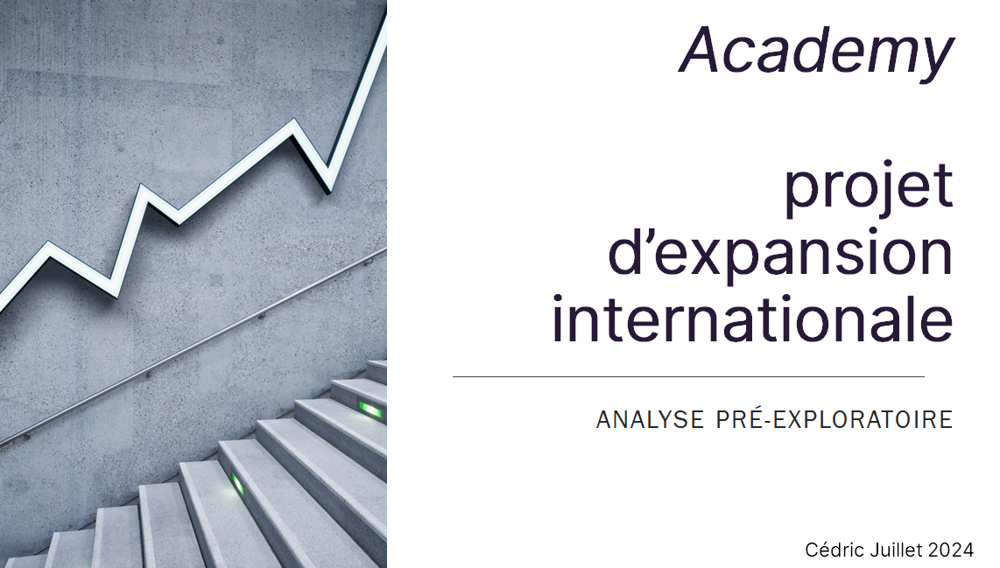

# 📌 Analyse des Données de Systèmes Éducatifs

## 📖 Contexte
**Data Scientist** dans la start-up EdTech **academy**, qui propose des contenus de formation en ligne pour des élèves de lycée et d’université. L’entreprise envisage une **expansion à l’international** et souhaite analyser les **données de la Banque Mondiale** pour identifier les pays les plus prometteurs.

## 🎯 Objectif du Projet
L’objectif est de mener une **analyse exploratoire** sur un jeu de données éducatif de la **Banque Mondiale** pour :
- ✅ Évaluer la **qualité** du jeu de données.
- ✅ Identifier les **indicateurs clés** pour la prise de décision.
- ✅ Analyser les tendances éducatives par pays et région.
- ✅ Proposer des recommandations stratégiques pour l’expansion.

## 🛠️ Étapes du Projet

### 1️⃣ **Analyse Générale des Données**
- Vérification des **données manquantes et dupliquées**.
- Description des fichiers (nombre de lignes, colonnes, types de variables).
- Sélection des **indicateurs pertinents**.

### 2️⃣ **Sélection et Nettoyage des Données**
- Filtrage des indicateurs les plus significatifs.
- Vérification et traitement des **valeurs aberrantes**.
- Réorganisation du dataset en un format exploitable.

### 3️⃣ **Création d'un DataFrame Exploitable**
- Structuration des données : une **ligne = un pays**.
- Sélection des **années pertinentes**.
- Création d’un **tableau pivot** pour une meilleure analyse.

### 4️⃣ **Analyse Exploratoire**
- Calcul des **statistiques descriptives** (moyenne, médiane, écart-type).
- Visualisation des données par **graphiques**.
- Analyse des **corrélations entre indicateurs**.
- Étude de l’évolution des indicateurs sur plusieurs années.

### 5️⃣ **Présentation des Résultats**
- Explication de la **méthodologie** utilisée.
- Recommandations sur la **pertinence des données**.
- Proposition des **meilleurs pays cibles** pour l’expansion.
- Création d’une **présentation claire et concise**.

## 📦 Livrables Attendus
✅ Un **notebook Jupyter** avec toutes les étapes d’analyse.
✅ Un **dataframe nettoyé** et structuré.
✅ Des **visualisations et graphiques** illustrant les tendances.
✅ Une **présentation synthétique** des résultats et recommandations.

## 🚀 Objectif Final
Fournir une **analyse approfondie** pour aider academy à prendre des décisions stratégiques basées sur les **données éducatives mondiales**.

---
👥 **Compétences requises** : Python, Pandas, Analyse de données, Visualisation.
🌍 **Sources des données** : Banque Mondiale.
